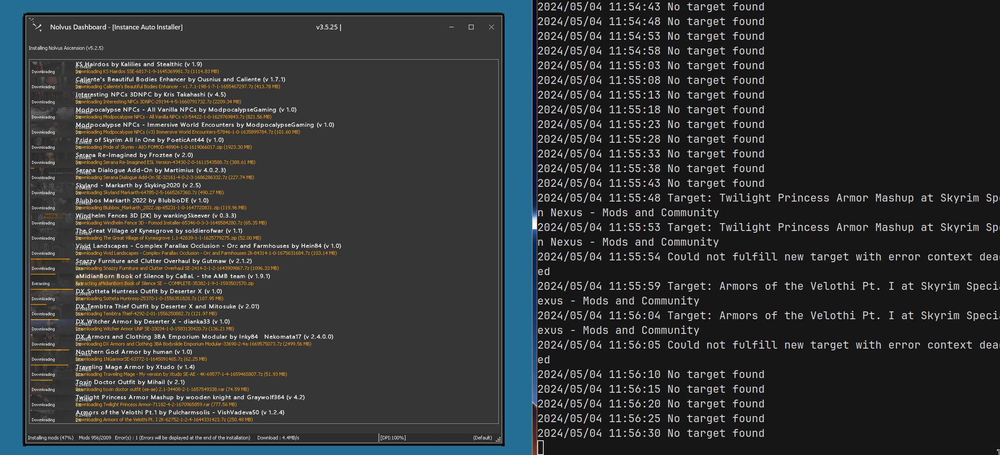

## Nolvus Automagic Downloader



### Background for those interested

The Nolvus modpack requires a lot of files to be downloaded from
Nexus Mods. Although possible to download the mods through manually
"clicking" the "Slow Download" button on the Nexus Mods website rendered
within the Nolvus Dashboard. This will take a substantial amount of time
to complete.

The solution of course is to just buy the premium subscription from 
Nexus Mods. But that's not why you are here ;) - nor me.

Being annoyed at manually clicking the slow download button, I decided to 
find out how to automate it. Of course the inital thought is to use an automated
mouse clicker. This doesn't work since the window rendering the website
might not be scrolled to the correct position or some Nexus mods video ads would
popup over the button etc.

### Requirements

Launch the Nolvus Dashboard with the `--remote-debugging-port=8088`.
This can be done on Windows by creating a shortcut of the executable
and then specifying the flags after the executable in the `Target` field.

Example:

```
Target: "<path to exe>" --remote-debugging-port=8088
```

Then run the Automagic Downloader.

```
go run .
```

### Build Nolvus Automagic Downloader

```console
git clone git@github.com:Benehiko/nolvus-automagic-downloader.git
cd nolvus-automagic-downloader
go build .
./nolvus-automagic-downloader
```

### Run Nolvus with Wine

Nolvus is a .Net application running [Chromium Embedded Framework (CEF)](https://bitbucket.org/chromiumembedded/cef/src/master/),
specifically [CEFSharp](https://cefsharp.github.io/).

The Wine setup I found to work through [bottles](https://usebottles.com/) with the `sys-wine-9.0` runner
and the following dependencies:

```
- arial32
- times32
- courie32
- mono
- gecko
- vcredist2019
- andale32
- arialb32
- comic32
- georgi32
- impact32
- tahoma32
- trebuc32
- verdan32
- webdin32
- allfonts
- dotnet40
- dotnet45
- dotnet46
- dotnet461
- dotnet462
- dotnet472
- vcredist2022
- vcredist6
- vcredist2015
- dotnet452
- vcredist2013
- consolas
- unifont
```

Once the Nolvus Dashboard does the installation steps (with the CEF popups) after clicking 
the "Slow Download" button it might give you an error about missing fonts, specifically the
SegoeUI fonts.

Below are instructions for installing Microsoft fonts on Arch.

```console
yay -Sy ttf-win10
```

Other packages such as `ttf-ms-win10-auto` didn't work for me.
https://wiki.archlinux.org/title/Microsoft_fonts

### Misc

Running the downloads this way could re-focus the mouse on to the popup window which is very
annoying if you are still using the PC.

So far I have been able to disable the rendering through CEF with additional flags but this 
does not prevent Nolvus from popping up a new window.

```console
--off-screen-rendering-enabled --headless --disable-gpu 
```


